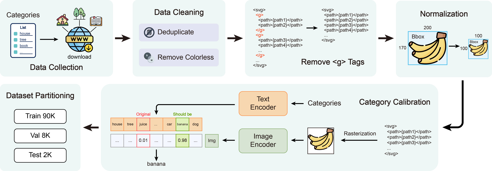
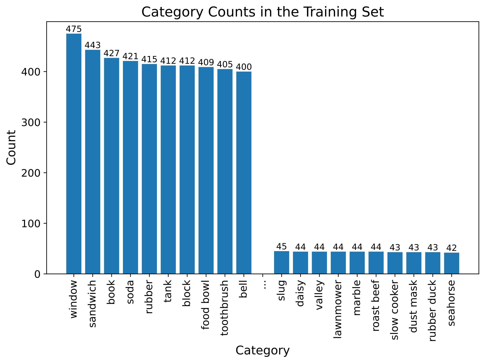
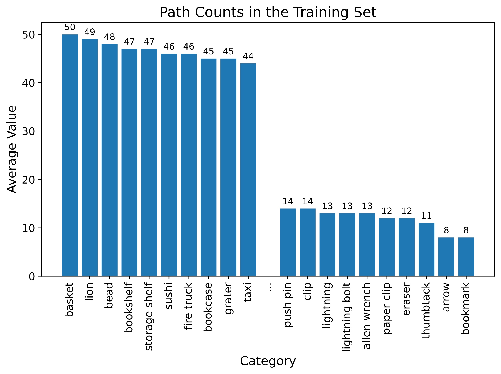
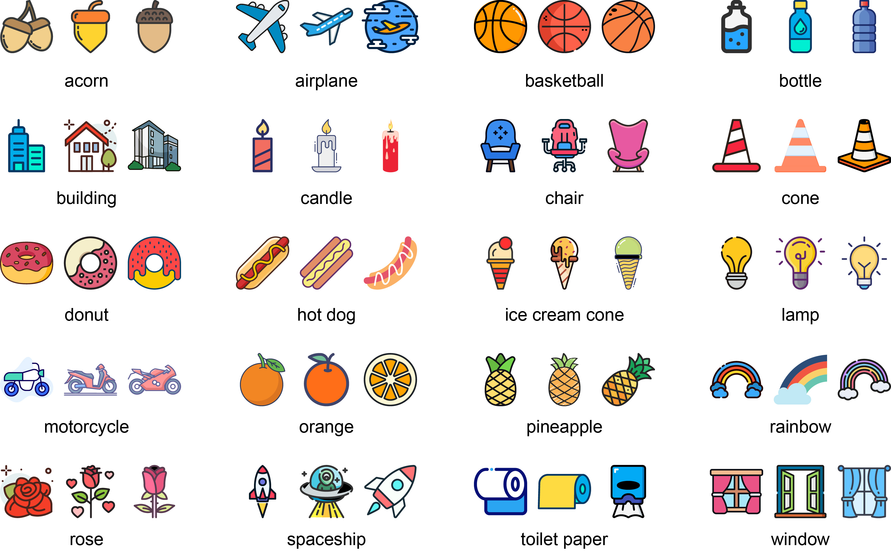

<h1 align="center">ColorSVG-100K Dataset</h1>

<p align="center">
    <a href="https://arxiv.org/abs/2412.10488"></a>
    &nbsp;&nbsp;
    <a href="https://arxiv.org/abs/2412.10488"></a>
    &nbsp;&nbsp;
    <a href="https://svgbuilder.github.io"></a>
</p>

<p align="center">
    
    &nbsp;&nbsp;
    
    &nbsp;&nbsp;
    <a href="http://creativecommons.org/licenses/by-nc-sa/4.0"></a>
</p>

# 📝 Introduction

This is the `ColorSVG-100K` dataset proposed in the paper [SVGBuilder: Component-Based Colored SVG Generation with Text-Guided Autoregressive Transformers](https://arxiv.org/abs/2412.10488).

This repository includes the original collected version, `ColorSVG-Raw`, which provides a foundational dataset for researchers and developers to perform further customization and innovative applications. Additionally, the processed version, `ColorSVG-100K`, constructed in the paper, is provided for direct use in training and research.

The dataset processing flow is as follows:



For more details on the dataset processing, please refer to `The ColorSVG-100K Dataset` section in the paper's `Appendix`.

❗️ The `ColorSVG-Raw` dataset may contain duplicate SVG files, and some files may be misclassified, requiring further processing.

# 📥 Download

You can download the `ColorSVG-Raw` and `ColorSVG-100K` datasets from the `GitHub Releases` of this repository.

You can also download them directly via the command line.

```bash
# Download ColorSVG-100K
wget https://github.com/amcghm/ColorSVG-100K/releases/download/v1.0/ColorSVG-100K.zip

# Download ColorSVG-Raw
wget https://github.com/amcghm/ColorSVG-100K/releases/download/v1.0/ColorSVG-Raw.zip
```

# 📊 Dataset Statistics

ColorSVG-100K contains:
- 100K samples
- 500 categories

<p align="center">
    
    
</p>

We conduct a detailed statistical analysis of the `ColorSVG-100K` dataset. In the training set, we categorize SVG samples according to their respective classes, tallying the number of samples in each category. The results are then sorted in descending order, with intermediate results omitted for clarity, as illustrated in the left subfigure above. The category with the highest number of samples contains up to 475 instances, while the category with the fewest samples has around 40 instances. This imbalance in the dataset arises from the varying prevalence of different SVG categories available online, where more common categories have more samples compared to the rarer ones.

We also analyze the average number of paths per category in the training set to assess the complexity of different categories. This analysis, sorted in descending order and with intermediate results omitted for clarity, is presented in the right subfigure above. The category with the highest average number of paths is `basket` followed by `lion` indicating these categories have more intricate designs with numerous lines, thus higher complexity. In contrast, the categories with the fewest average paths are `arrow` and `bookmark` suggesting these SVGs are less complex.

# 🎨 Dataset Examples

We randomly select several categories from the training set, showcasing three randomly chosen examples from each category, as illustrated in the figure below.



# 📚 Citation

If you find the dataset helpful for your research, please cite our paper:

```
@article{chen2024svgbuilder,
  title   = {SVGBuilder: Component-Based Colored SVG Generation with Text-Guided Autoregressive Transformers},
  author  = {Chen, Zehao and Pan, Rong},
  journal = {arXiv preprint arXiv:2412.10488},
  year    = {2024}
}
```

# ⚖️ License

<a href="http://creativecommons.org/licenses/by-nc-sa/4.0"></a>

This dataset is created only for academic research purposes and cannot be used for commercial purposes. It is licensed under the [Creative Commons Attribution-NonCommercial-ShareAlike 4.0 International License](http://creativecommons.org/licenses/by-nc-sa/4.0).